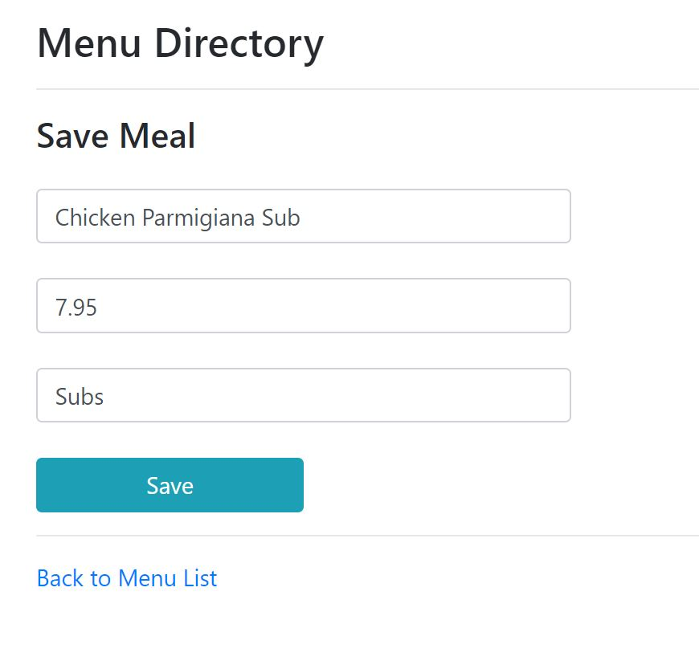

# Crush E-Commerce

This is a Spring MVC e-commerce web application which supports user authentication/authorization, complete purchasing experience, and CRUD operations via Restful service and admin pages.

[Live demo](http://crush.us-east-2.elasticbeanstalk.com/)

## Preview


User admin page:


Menu admin page:


Update a meal:



Restful API page:


Restful example:


Login page:


Register page:


Payment page:


Payment success:


## Getting started

### Prerequisites

- Spring Boot
- Intellij/Eclipse
- MySQL
- Stripe Account
  
### Usage

- Populate database with `crush.sql` in MySQL
- Set up datasource of your database in `application.properties` file
    ```text
    # Datasource properties
    spring.datasource.url=jdbc:mysql://localhost:3306/<dbname>
    spring.datasource.username=<connection username>
    spring.datasource.password=<connection password>
    ```
- Set up your stripe public/secret key in `application.properties` file
    ```text
    # stripe key
    STRIPE_PUBLIC_KEY=<stripe public key>
    STRIPE_SECRET_KEY=<stripe secret key>
    ```
- Set up your port number
  
  ```
  server.port=<your port number>
  ```

- Run application
- Open `http://localhost:<port number>` on browser
  
Note: by default in `application.properties` file, the port number is set to 5000

### Deploy the appplication to AWS

Please refer to the article: [The Ultimate Guide to Hosting a Java Web App with Amazon Web Services (AWS)
](https://howtoprogramwithjava.com/ultimate-guide-hosting-java-web-app-amazon-web-services-aws/#commentform)
